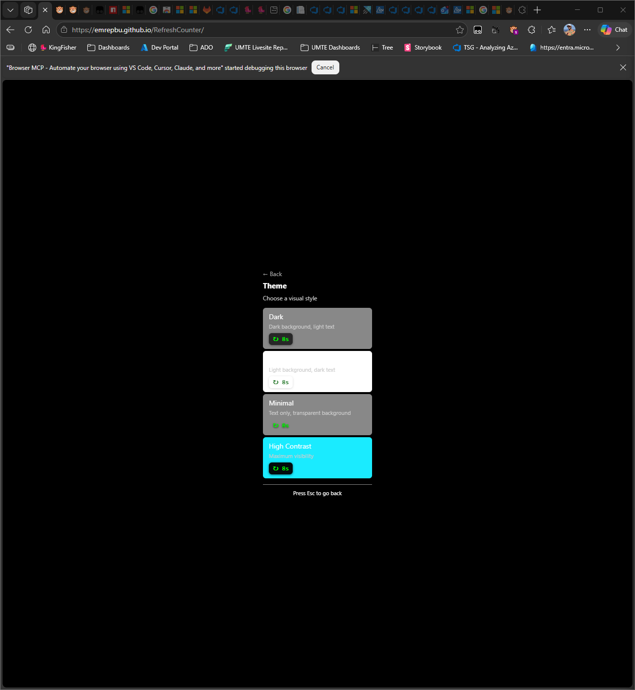
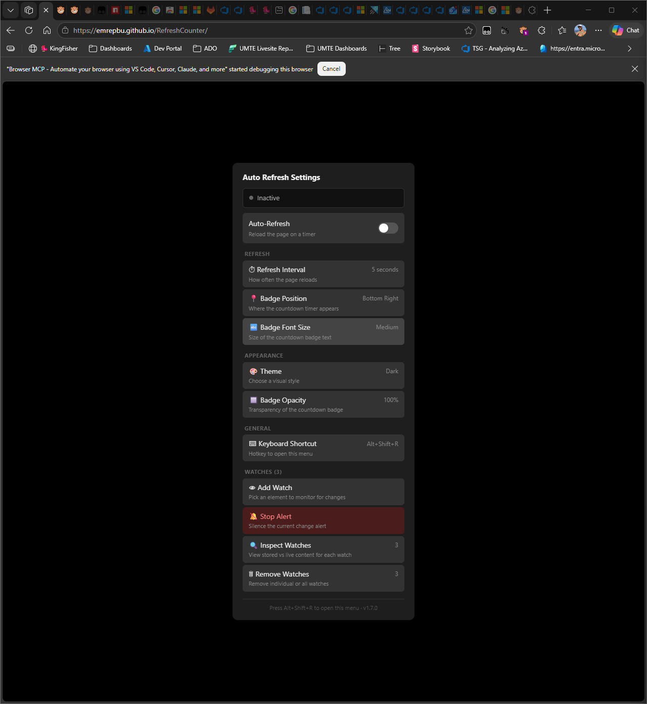
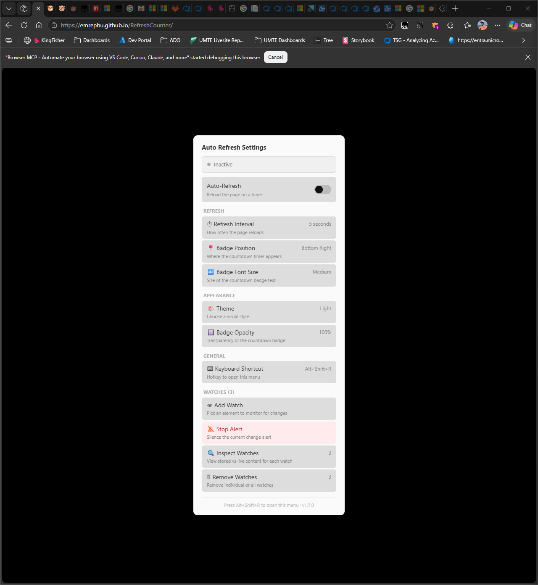
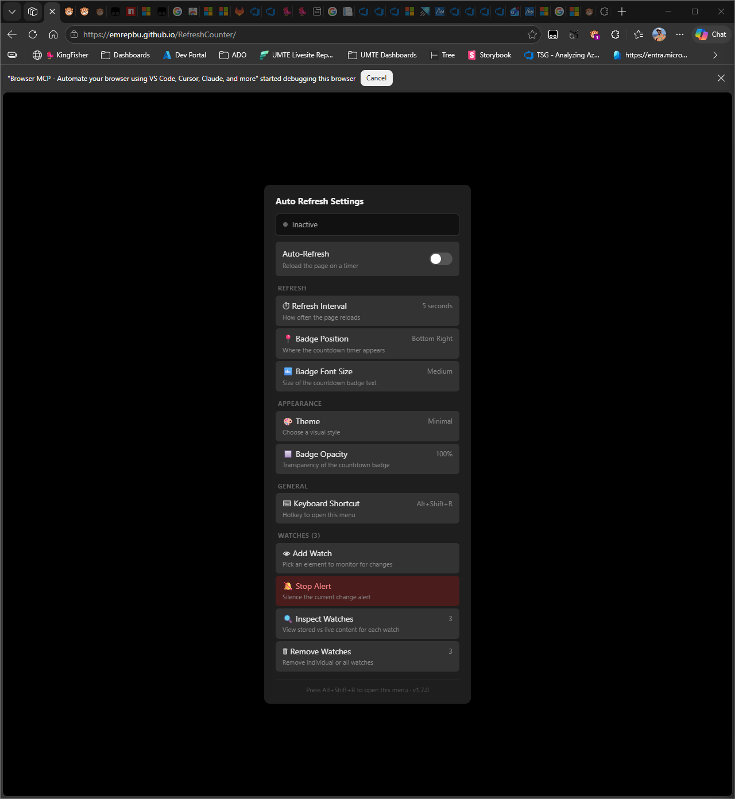
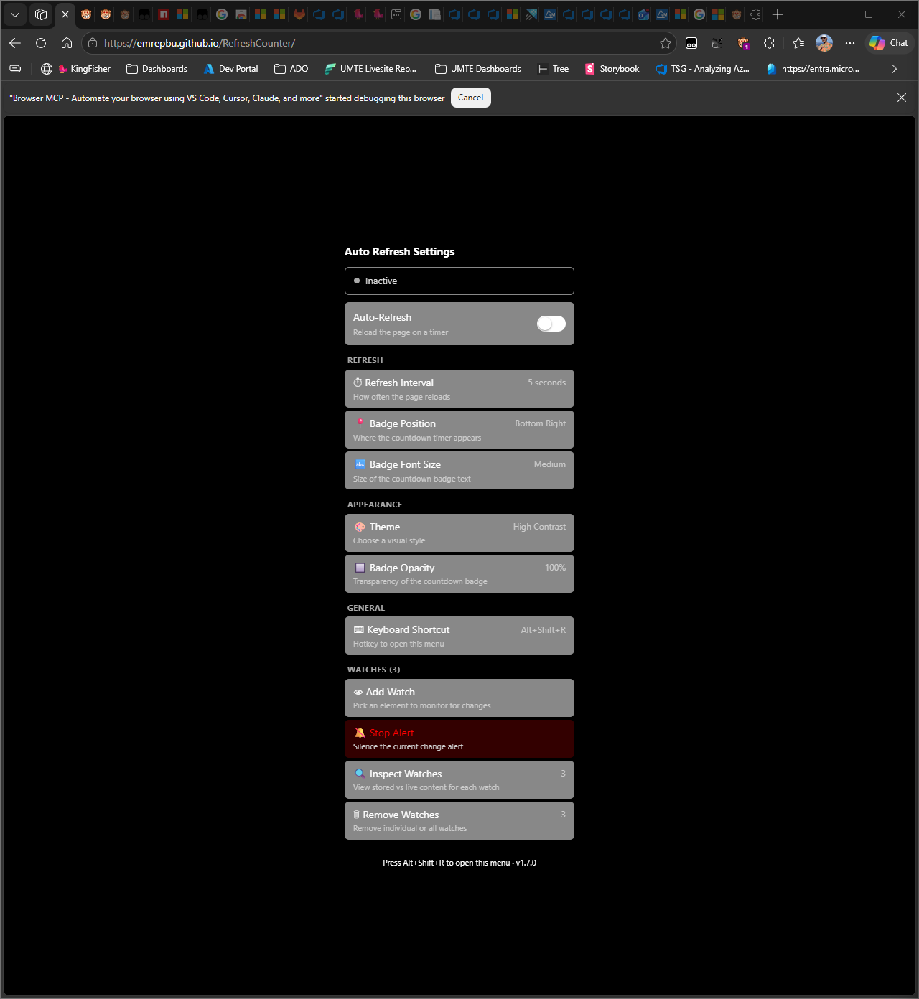
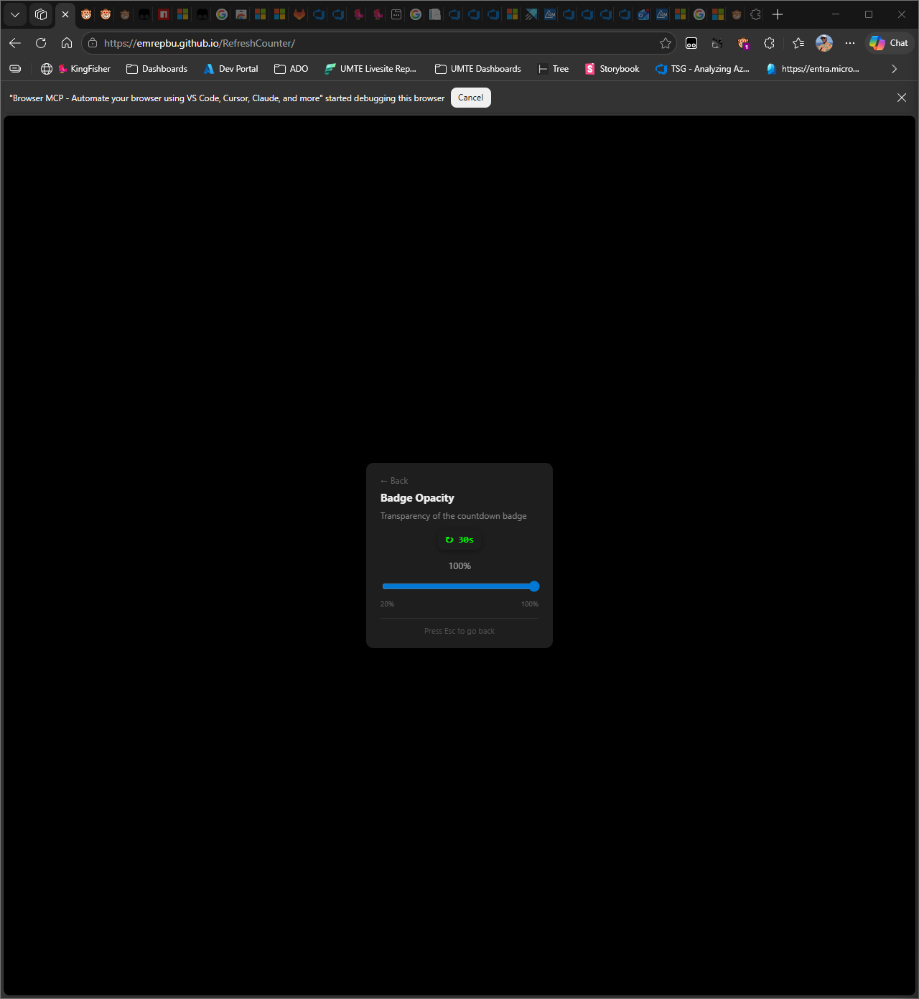

# Feature Spec: Theme System & Visual Customization

## Overview

Allow users to customize the appearance of the auto-refresh UI — badge, modals, toasts — with theme presets and individual color/opacity controls.

---

## Problem Statement

The current UI uses a fixed dark theme that:
- Clashes with light-themed websites
- Can't be adjusted for visibility on dark pages where the badge blends in
- Has no transparency controls — badge may obscure critical content
- Users with visual preferences (high contrast, specific colors) have no options

---

## User Stories

- As a user on a white-background site, I want a light-themed auto-refresh badge.
- As a user, I want to adjust badge opacity so it doesn't cover content.
- As a user with color vision deficiency, I want to customize urgency colors.

---

## UX Design

### Settings Integration

```
APPEARANCE
🎨 Theme                  Dark (default)
   Choose a visual style
🔲 Badge Opacity           100%
   Transparency of the countdown badge
```

### Theme Picker

```
┌──────────────────────────────────────────┐
│ ← Back                                  │
│ Theme                                    │
│ Choose a visual style                    │
│                                          │
│  ┌── Dark ✓ ──── [↻ 8s] ────────────┐   │
│  │  Dark background, light text      │   │
│  └───────────────────────────────────┘   │
│  ┌── Light ────── [↻ 8s] ───────────┐   │
│  │  Light background, dark text      │   │
│  └───────────────────────────────────┘   │
│  ┌── Minimal ──── [↻ 8s] ───────────┐   │
│  │  Text only, transparent bg        │   │
│  └───────────────────────────────────┘   │
│  ┌── High Contrast [↻ 8s] ──────────┐   │
│  │  Maximum visibility               │   │
│  └───────────────────────────────────┘   │
│                                          │
│  Press Esc to go back                    │
└──────────────────────────────────────────┘
```

Each option shows a live preview of the badge in that theme.

### Opacity Slider

Range input: 20% to 100% in 10% steps. Badge previews at selected opacity.

Badge hover overrides opacity to 100% for readability.

---

## User Behaviors

| Behavior | Expected Response |
|----------|-------------------|
| Select Light theme | Badge, modals, toasts switch to light styling |
| Select Minimal | Badge becomes text-only with no background |
| Set opacity to 40% | Badge at 40% opacity; hover raises to 100% |
| High Contrast selected | Bold borders, large text, high-contrast colors |
| Theme applied | Immediate effect; no page reload needed |

---

## Technical Notes

### Theme Definitions

```javascript
const THEMES = {
    dark: {
        badge: { bg: '#1a1a2e', text: '#fff', border: '#333' },
        modal: { bg: '#1e1e1e', text: '#eee', border: '#444', headerBg: '#252525' },
        toast: { bg: '#0078d4', text: '#fff' },
        urgency: { high: '#4caf50', medium: '#ff9800', low: '#f44336' }
    },
    light: {
        badge: { bg: '#ffffff', text: '#333', border: '#ddd' },
        modal: { bg: '#fafafa', text: '#333', border: '#ccc', headerBg: '#f0f0f0' },
        toast: { bg: '#0078d4', text: '#fff' },
        urgency: { high: '#2e7d32', medium: '#e65100', low: '#c62828' }
    },
    minimal: {
        badge: { bg: 'transparent', text: '#fff', border: 'none' },
        modal: { bg: '#1e1e1e', text: '#eee', border: '#444', headerBg: '#252525' },
        toast: { bg: '#0078d4', text: '#fff' },
        urgency: { high: '#4caf50', medium: '#ff9800', low: '#f44336' }
    },
    highContrast: {
        badge: { bg: '#000', text: '#fff', border: '#fff' },
        modal: { bg: '#000', text: '#fff', border: '#fff', headerBg: '#111' },
        toast: { bg: '#ffff00', text: '#000' },
        urgency: { high: '#00ff00', medium: '#ffff00', low: '#ff0000' }
    }
};
```

### Application

```javascript
function applyTheme(themeName) {
    const theme = THEMES[themeName];
    // Update badge
    badge.style.background = theme.badge.bg;
    badgeText.style.color = theme.badge.text;
    badge.style.borderColor = theme.badge.border;
    // Store for modal/toast creation
    GM_setValue('ar_theme', themeName);
}
```

### Storage Keys

```javascript
GM_getValue('ar_theme', 'dark')
GM_getValue('ar_badge_opacity', 1.0)
```

### Risk Assessment

| Risk | Severity | Mitigation |
|------|----------|------------|
| Theme colors clash with specific sites | Low | 4 options cover most scenarios; user can switch |
| Minimal theme badge invisible on some backgrounds | Low | Hover always shows full opacity; text shadow helps |
| High contrast may look harsh | Low | Opt-in; designed for users who need it |

---

## Implementation Details

**Version**: 1.7.0
**Date**: 2026-04-11
**Action Plan**: [action-plans/theme-system.md](../action-plans/theme-system.md)

### What Was Built
- 4 theme presets (Dark, Light, Minimal, High Contrast) with full color mappings for all T object properties
- `buildCss()` function extracted from inline CSS to enable CSS rebuild on theme change
- `applyTheme(themeName)` updates T object, rebuilds CSS, refreshes badge inline styles
- `applyBadgeOpacity(val)` sets badge opacity with 20-100% range, hover override to 100%
- Theme picker modal with live badge preview per theme
- Opacity picker modal with range slider and live badge preview
- Two new settings entries under "Appearance" section
- `initTheme()` IIFE restores saved theme and opacity on load
- `getModeColor()` function replaces static `MODE_COLORS` const (stale after theme change)

### Deviations from Spec
- Spec defined themes with badge/modal/toast/urgency sub-objects; implementation maps directly to T object properties for simpler application
- `MODE_COLORS` const was replaced with `getModeColor()` function to stay current with theme changes
- CSS extracted into `buildCss()` function (not in spec) to enable re-rendering

### Code Location
| Component | Location |
|-----------|----------|
| `THEMES` object | Line ~87 |
| `THEME_LABELS` | Line ~85 |
| `STORAGE_KEY_THEME` / `STORAGE_KEY_OPACITY` | Line ~158 |
| `buildCss()` | Line ~247 |
| `applyTheme()` | Line ~491 |
| `applyBadgeOpacity()` | Line ~509 |
| `initTheme()` | Line ~514 |
| `getModeColor()` | Line ~63 |
| Theme picker modal | Line ~838 |
| Opacity picker modal | Line ~874 |
| Settings Appearance section | Line ~1395 |

### Testing Notes
- All 4 themes verified visually via browser testing
- Theme selection toast confirmed
- Settings modal correctly shows current theme name and opacity
- Opacity picker slider and preview work correctly
- No console errors
- Ctrl+Right-Click context menu cannot be tested via MCP (manual test needed)

### Screenshots

#### Theme Picker


#### Dark Theme (Default)


#### Light Theme


#### Minimal Theme


#### High Contrast Theme


#### Badge Opacity Picker

