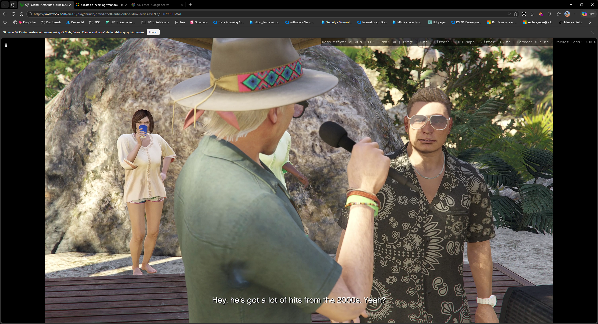
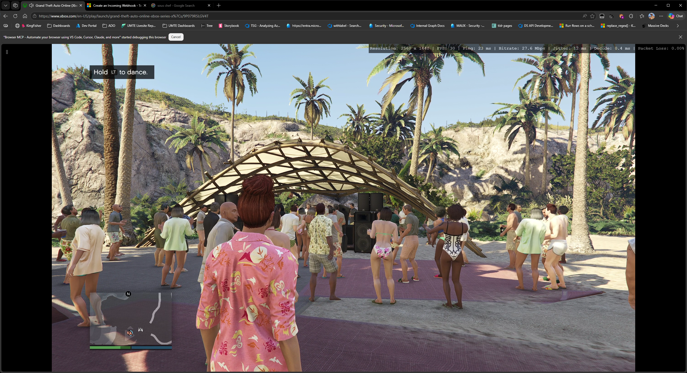
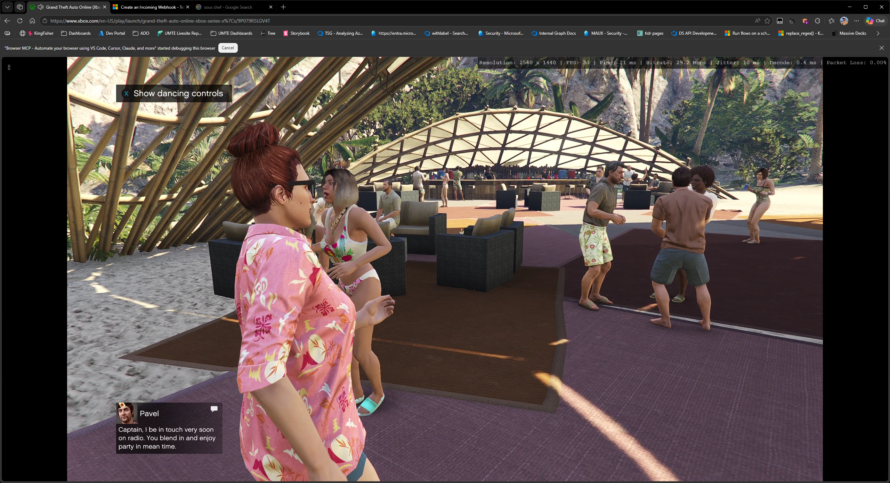

# Feature Spec: Multi-Webhook Support

## Overview

Enhance the webhook notification system to support multiple independently configured webhooks, each with their own URL, format, enable/disable toggle, and optional label. A global enable/disable toggle is retained to quickly silence all webhooks without losing individual configurations.

---

## Problem Statement

The current webhook system supports only a single endpoint. Users who want to notify multiple services (e.g., Slack for the team + Teams for a personal channel + a generic endpoint for logging) must choose one or reconfigure each time. There is no way to send the same change detection event to multiple destinations simultaneously.

---

## User Stories

- As a user monitoring a page, I want to send change alerts to both Slack and Teams so that different teams are notified through their preferred platform.
- As a user with multiple webhook endpoints, I want to enable/disable individual webhooks without deleting their configuration so I can temporarily silence one destination.
- As a user, I want a global webhook toggle so I can quickly mute all webhook notifications during maintenance without touching each one.
- As a user, I want to label my webhooks (e.g., "Team Slack", "Logging Server") so I can easily identify them in the list.
- As a user, I want to add and remove webhooks freely without a hard limit so the system scales with my needs.

---

## UX Design

### Settings Panel — Webhook Row

The settings row changes from a single "On/Off" to show the count of enabled webhooks:

```
┌──────────────────────────────────────────┐
│  🌐 Webhook                    2 of 3 on │
│  Send alerts to external services        │
└──────────────────────────────────────────┘
```

When no webhooks exist: value shows `None`. When all are disabled or global is off: value shows `Off`.

### Webhook List Modal (`webhook-list`)

Replaces the current `webhook-config` modal as the first screen. Shows a global toggle and a list of configured webhooks.

```
┌──────────────────────────────────────────┐
│  ← Back                                 │
│  Webhook Notifications                   │
│  Send alerts to external services        │
│                                          │
│  ┌────────────────────────────────────┐  │
│  │ Webhooks Enabled          [ON]     │  │
│  │ Global kill switch for all webhooks│  │
│  └────────────────────────────────────┘  │
│                                          │
│  WEBHOOKS (2)                            │
│  ┌────────────────────────────────────┐  │
│  │ ● Team Slack              [ON]     │  │
│  │   Slack · Block Kit message        │  │
│  ├────────────────────────────────────┤  │
│  │ ○ Logging Server          [OFF]    │  │
│  │   Generic JSON · Custom template   │  │
│  └────────────────────────────────────┘  │
│                                          │
│  [+ Add Webhook]                         │
│                                          │
│  Press Esc to go back                    │
└──────────────────────────────────────────┘
```

- **Global toggle**: Immediately persists. When off, no webhooks fire regardless of individual states. Visual: all webhook rows dim when global is off.
- **Per-webhook toggle**: Inline toggle on each row. Immediately persists enabled state.
- **Webhook rows**: Show label (or URL fragment if no label), format name, status dot (green=on, gray=off).
- **Click a webhook row**: Opens `webhook-edit` modal for that webhook.
- **"+ Add Webhook" button**: Opens `webhook-edit` modal with empty defaults.

### Webhook Edit Modal (`webhook-edit`)

Replaces the current `webhook-config` modal. Nearly identical layout but adds a label field and a delete option.

```
┌──────────────────────────────────────────┐
│  ← Back                                 │
│  Edit Webhook                            │
│  Configure this webhook endpoint         │
│                                          │
│  LABEL (OPTIONAL)                        │
│  ┌────────────────────────────────────┐  │
│  │ Team Slack                         │  │
│  └────────────────────────────────────┘  │
│                                          │
│  WEBHOOK URL                             │
│  ┌────────────────────────────────────┐  │
│  │ https://hooks.slack.com/services/… │  │
│  └────────────────────────────────────┘  │
│                                          │
│  FORMAT                                  │
│  [Slack ✓] [Discord] [Teams] [Generic]   │
│                                          │
│  (Template section if Generic selected)  │
│                                          │
│  [🧪 Send Test]  [💾 Save]              │
│                                          │
│  🗑 Delete Webhook                       │
│                                          │
│  Press Esc to go back                    │
└──────────────────────────────────────────┘
```

- **Label**: Optional text input. If empty, the list shows a URL fragment (first 30 chars of URL).
- **Delete Webhook**: Red link button at the bottom. Confirm-on-second-click pattern (same as "Clear All" watches).
- **Save**: Validates URL, saves to the webhooks array, returns to `webhook-list`.
- **New webhook**: Title shows "Add Webhook" instead of "Edit Webhook". No delete button shown.

### Settings Integration

- The `🌐 Webhook` row in Settings opens `webhook-list` (not `webhook-edit` directly).
- Value text: `"2 of 3 on"` / `"Off"` (global disabled) / `"None"` (no webhooks configured).

---

## Technical Design

### Data Model

**Storage key**: `STORAGE_KEY_WEBHOOK = 'autoRefreshWebhook'` (unchanged)

**New format** — the stored value changes from a single object to a wrapper:

```javascript
{
  globalEnabled: true,           // Global kill switch
  webhooks: [                    // Array of webhook configs
    {
      id: 'wh_m1abc_x2y3z4',    // Unique ID (same pattern as watch IDs)
      label: 'Team Slack',      // Optional display name
      url: 'https://hooks.slack.com/services/...',
      format: 'slack',           // 'slack' | 'discord' | 'teams' | 'generic'
      template: '',              // Only used when format='generic'
      enabled: true              // Per-webhook toggle
    },
    {
      id: 'wh_m1abd_a1b2c3',
      label: '',
      url: 'https://discord.com/api/webhooks/...',
      format: 'discord',
      template: '',
      enabled: false
    }
  ]
}
```

**Migration**: On first load, if the stored value is an object with a `url` property (old format), migrate it:

```javascript
function _getWebhookConfig() {
    const raw = GM_getValue(STORAGE_KEY_WEBHOOK, null);
    if (!raw) return { globalEnabled: false, webhooks: [] };
    // Migrate legacy single-webhook format
    if (raw.url !== undefined) {
        const migrated = {
            globalEnabled: raw.enabled !== false && !!raw.url,
            webhooks: raw.url ? [{
                id: generateId().replace('w_', 'wh_'),
                label: '',
                url: raw.url,
                format: raw.format || 'generic',
                template: raw.template || '',
                enabled: raw.enabled !== false
            }] : []
        };
        GM_setValue(STORAGE_KEY_WEBHOOK, migrated);
        return migrated;
    }
    return raw;
}
```

### Core Logic

**`sendWebhook(changeDetails)`** changes:

```javascript
function sendWebhook(changeDetails) {
    const config = _getWebhookConfig();
    if (!config.globalEnabled) return;

    const now = Date.now();
    if (now - _lastWebhookTime < WEBHOOK_RATE_LIMIT_MS) return;

    const activeWebhooks = config.webhooks.filter(wh => wh.enabled && wh.url);
    if (activeWebhooks.length === 0) return;

    _lastWebhookTime = now;

    for (const wh of activeWebhooks) {
        const payload = formatWebhookPayload(wh.format, changeDetails, wh.template);
        GM_xmlhttpRequest({
            method: 'POST',
            url: wh.url,
            headers: { 'Content-Type': 'application/json' },
            data: JSON.stringify(payload),
            onload: (res) => {
                if (res.status >= 400) console.warn(`[AutoRefresh] Webhook "${wh.label || wh.url}" failed:`, res.status);
            },
            onerror: (err) => {
                console.warn(`[AutoRefresh] Webhook "${wh.label || wh.url}" error:`, err);
            }
        });
    }
}
```

Key changes:
- Rate limiting applies globally (one 30s cooldown across all webhooks per change event), not per-webhook.
- All enabled webhooks fire in parallel for the same change event.
- `formatWebhookPayload` is unchanged — called per webhook with its own format/template.

**`sendTestWebhook(config)`** is unchanged — it takes a single webhook's config and returns a Promise.

### Integration Points

- **Watch system (`checkForChanges`)**: No changes needed — it calls `sendWebhook(details)` which handles the multi-dispatch internally.
- **Modal framework**: Two new modals (`webhook-list`, `webhook-edit`) replace the current `webhook-config`.
- **Settings panel**: Webhook row value label logic changes to count enabled webhooks.
- **`generateId()`**: Reuse the existing function, but use prefix `wh_` instead of `w_` for webhook IDs.

### Helper Functions

```javascript
function _saveWebhookConfig(config) {
    GM_setValue(STORAGE_KEY_WEBHOOK, config);
}

function _webhookDisplayLabel(wh) {
    if (wh.label) return wh.label;
    if (wh.url) return wh.url.length > 30 ? wh.url.slice(0, 30) + '…' : wh.url;
    return '(no URL)';
}
```

---

## Edge Cases & Error Handling

- **Empty webhooks array**: Settings row shows "None". List modal shows an empty state: "No webhooks configured yet" with the Add button.
- **All webhooks disabled**: Settings row shows "Off". List shows the webhooks with gray dots.
- **Global toggle off**: Settings row shows "Off". List dims all webhook rows. Individual toggles are still interactive (so you can pre-configure before re-enabling global).
- **Delete last webhook**: After deletion, if array is empty, return to list showing empty state.
- **Duplicate URLs**: Allowed — user may want the same endpoint with different formats or templates.
- **Migration from v1.9.x**: Old single-object format is silently migrated on first read. No user action needed.
- **Rate limiting**: The 30s rate limit applies per change event globally. If a change fires, all active webhooks send, then the 30s cooldown starts. This prevents webhook spam while ensuring all endpoints are notified of each event.
- **Large number of webhooks**: No hard limit, but `GM_xmlhttpRequest` calls are fire-and-forget. 10+ simultaneous requests could slow the page — consider documenting a soft recommendation of ≤5 webhooks.

---

## Scope & Non-Goals

### In Scope
- Multiple webhook configurations with independent enable/disable
- Global enable/disable toggle
- Optional labels for each webhook
- Migration from single-webhook format
- Add/edit/delete webhook UI
- Webhook list modal with inline toggles
- Per-webhook test button (in edit modal)

### Out of Scope (Future)
- Per-webhook rate limiting (currently global 30s cooldown)
- Webhook-specific event filters (e.g., only fire for content changes, not style changes)
- Webhook delivery history/logs
- Webhook retry on failure
- Drag-and-drop reordering of webhooks
- Webhook groups or categories

---

## Risks & Open Questions

1. **Rate limiting strategy**: Should the 30s cooldown be per-webhook or global? Global is simpler and prevents burst traffic, but per-webhook would allow more granular control. **Recommendation**: Keep global for v1, add per-webhook as a future enhancement.
2. **Storage size**: Each webhook config is ~200-300 bytes. Even 20 webhooks would be under 6 KB — well within `GM_setValue` limits.
3. **Parallel request failures**: If one webhook fails (network error, 4xx), others still fire. Should failures be surfaced to the user? **Recommendation**: Log to console only — matching current behavior. A future "delivery history" feature could surface this.
4. **Test button scope**: In the edit modal, "Send Test" tests only that specific webhook. Should there be a "Test All" in the list modal? **Recommendation**: Not for v1 — test individually is clearer.

---

## Implementation Details

**Version**: 2.0.0
**Date**: 2026-04-11
**Action Plan**: [action-plans/multi-webhook.md](../action-plans/multi-webhook.md)

### What Was Built
- Refactored webhook system from single-webhook to multi-webhook with independent configuration per endpoint
- Automatic migration from v1.9.x single-webhook format (detected by presence of `url` property on stored object)
- Two new modals: `webhook-list` (global toggle, per-webhook list with inline toggles) and `webhook-edit` (add/edit/delete individual webhooks)
- Extracted repeated toggle inline styles into CSS classes (`ar-toggle-track`, `ar-toggle-track-sm`, `ar-toggle-thumb`, `ar-toggle-thumb-sm`)
- Multi-dispatch in `sendWebhook()` — fires to all enabled webhooks with global 30s rate limit

### Deviations from Spec
1. Webhook IDs use `wh_` prefix for disambiguation from watch IDs
2. Cleanup logic uses `setTimeout` + `Modal.hasInStack()` guard to prevent race conditions during save/delete navigation
3. Toggle CSS classes extracted as part of code quality phase — benefits all toggles system-wide, not just webhooks
4. `WEBHOOK_FORMAT_LABELS` constant re-added for display in webhook-list rows

### Code Location
| Component | Location |
|-----------|----------|
| `_getWebhookConfig()` with migration | Line ~716 |
| `_saveWebhookConfig()` | Line ~748 |
| `_webhookDisplayLabel()` | Line ~752 |
| `sendWebhook()` multi-dispatch | Line ~822 |
| `WEBHOOK_FORMAT_LABELS` | Line ~1569 |
| `webhook-list` modal | Line ~1571 |
| `webhook-edit` modal | Line ~1681 |
| Settings row (webhook label) | Line ~2128 |
| CSS toggle classes | Line ~289 (in `buildCss()`) |

### Testing Notes
- Browser-verified via MCP browser: settings modal renders "1 of 1 on", webhook-list shows global toggle + webhook row with inline toggle, webhook-edit shows all fields (label, URL, format picker, template, test/save/delete)
- Navigation verified: Settings → webhook-list → webhook-edit → Back → Back → Settings all work correctly
- Format switching verified: selecting Slack hides template section, Generic JSON shows it
- Add Webhook flow: title shows "Add Webhook", no delete button, empty fields
- Edit Webhook flow: title shows "Edit Webhook", pre-filled fields, delete button present
- Manual testing required for: actual webhook delivery, save/delete persistence, global toggle dimming, inline toggle persistence

### Screenshots



