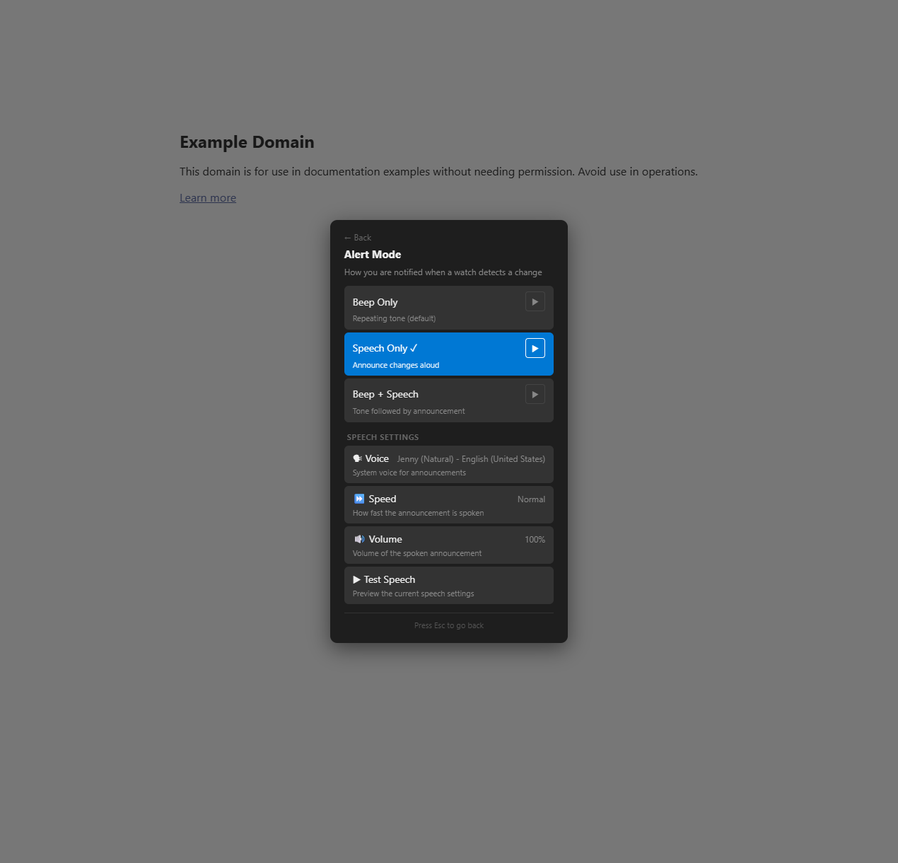
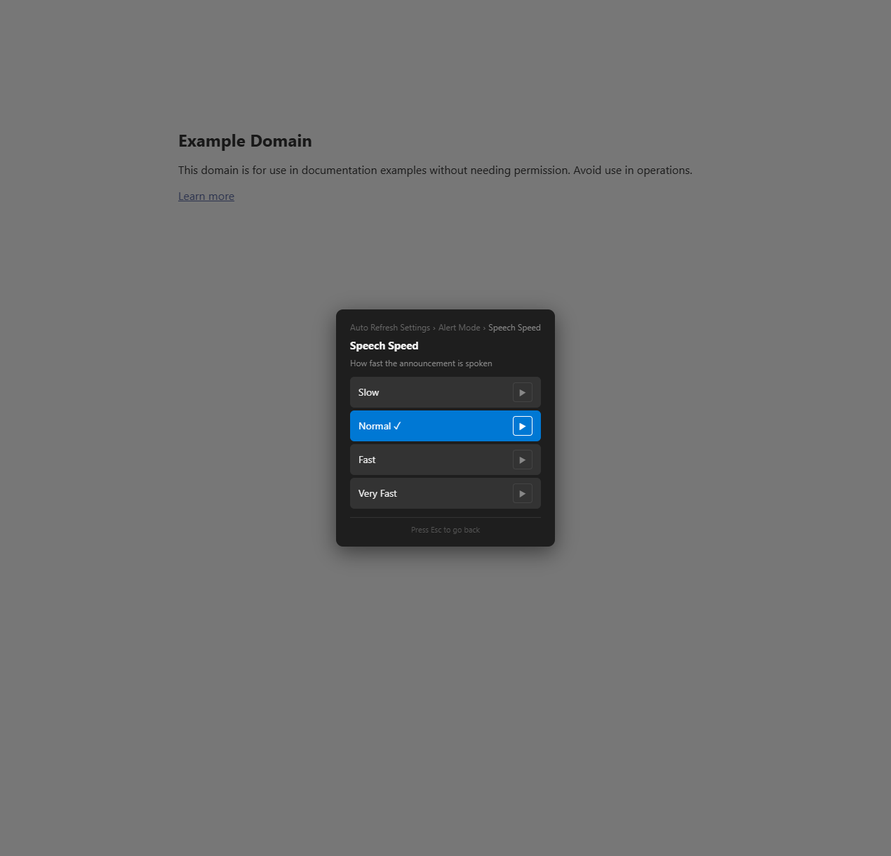
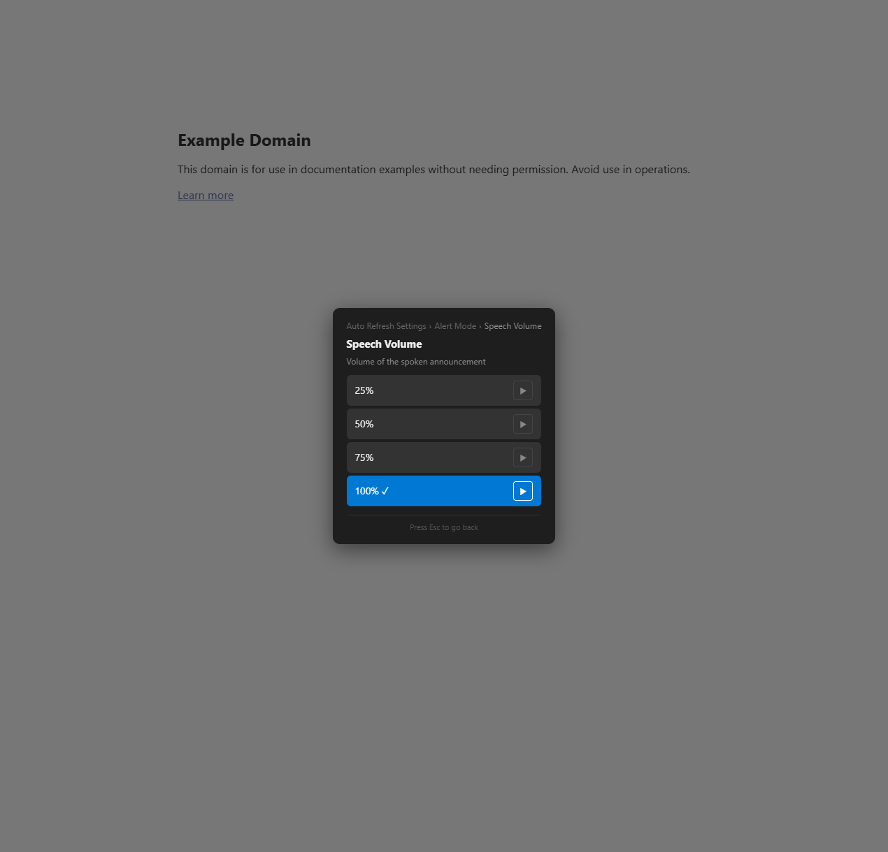
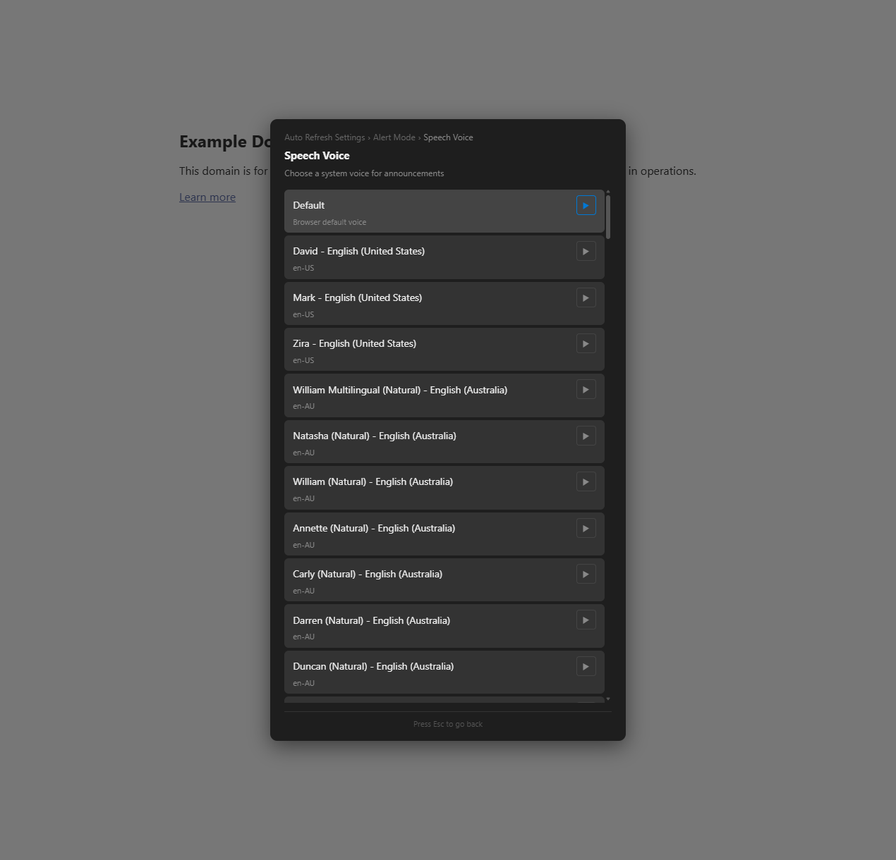

# Feature Spec: Speech Preview in Pickers

## Overview

Allow users to audition TTS voices, speeds, and volumes directly from within the picker modals before committing a selection. Each option row gains a small play button that speaks a short sample using that option's value — keeping all other settings unchanged — so users can compare choices side-by-side without leaving the picker.

---

## Problem Statement

The current "▶ Test Speech" button in the Alert Mode panel speaks using the *already-saved* settings. To compare two voices, a user must: select voice A → go back → press Test → return to the picker → select voice B → go back → press Test again. This round-trip makes it tedious to find the right voice, speed, or volume. Inline previews eliminate the round-trip entirely.

---

## User Stories

- As a user browsing the **Voice picker**, I want to hear each voice speak a sample sentence so I can compare accents and clarity before choosing one.
- As a user in the **Speed picker**, I want to hear the difference between Slow, Normal, Fast, and Very Fast so I can pick the right pace.
- As a user in the **Volume picker**, I want to hear the loudness difference between 25%, 50%, 75%, and 100% without saving each one first.
- As a user previewing a voice, I want the previous preview to stop immediately when I tap another play button so sounds don't overlap.
- As a user who selected the **Beep** alert mode, I want to hear a beep preview in the Alert Mode picker so I know what the beep sounds like.

---

## UX Design

### Voice Picker — Inline Preview

Each voice option row gets a small play icon button on the right. Pressing it speaks the test sentence using that voice (at the currently saved rate and volume). Only one preview can play at a time — starting a new one cancels the previous.

```
┌──────────────────────────────────────────┐
│  Speech Voice                            │
│  Choose a system voice for announcements │
│──────────────────────────────────────────│
│  ✓ Zira — English (US)           [▶]    │
│    Mark — English (US)           [▶]    │
│    David — English (US)          [▶]    │
│    Sabina — Spanish (Mexico)     [▶]    │
│                                          │
│  ⌄ Show all languages                   │
└──────────────────────────────────────────┘
```

- `[▶]` — idle state; tap to play preview
- `[■]` — playing state; tap to stop (or it auto-stops when utterance finishes)
- Icon reverts to `[▶]` after playback completes or is cancelled

### Speed Picker — Inline Preview

Each speed option plays the test sentence at that rate, using the currently saved voice and volume.

```
┌──────────────────────────────────────────┐
│  Speech Speed                            │
│  How fast the announcement is spoken     │
│──────────────────────────────────────────│
│    Slow (0.7×)                   [▶]    │
│  ✓ Normal (1.0×)                 [▶]    │
│    Fast (1.3×)                   [▶]    │
│    Very Fast (1.6×)              [▶]    │
└──────────────────────────────────────────┘
```

### Volume Picker — Inline Preview

Each volume option plays the test sentence at that volume, using the currently saved voice and rate.

```
┌──────────────────────────────────────────┐
│  Speech Volume                           │
│  Volume of the spoken announcement       │
│──────────────────────────────────────────│
│    25%                           [▶]    │
│    50%                           [▶]    │
│    75%                           [▶]    │
│  ✓ 100%                         [▶]    │
└──────────────────────────────────────────┘
```

### Alert Mode Picker — Beep Preview

The "Beep Only" and "Beep + Speech" rows gain a preview button that plays a single beep tone (not repeating). The "Speech Only" and "Beep + Speech" rows' existing "▶ Test Speech" button already covers the speech side — but it should also be available inline on those rows for consistency.

```
┌──────────────────────────────────────────┐
│  Alert Mode                              │
│──────────────────────────────────────────│
│  ✓ Beep Only — Repeating tone    [▶]    │
│    Speech Only — Announce aloud  [▶]    │
│    Beep + Speech — Tone + voice  [▶]    │
│──────────────────────────────────────────│
│  Speech Settings                         │
│  ...                                     │
└──────────────────────────────────────────┘
```

For "Beep Only", preview plays one beep.  
For "Speech Only", preview speaks the test sentence.  
For "Beep + Speech", preview plays one beep then speaks.

### Visual Feedback

- The play button uses `▶` (U+25B6) in idle and `■` (U+25A0) when playing.
- A subtle CSS pulse animation or opacity change on the button while audio is active provides visual feedback.
- The button uses `var(--ar-accent)` for the playing state.

### Settings Integration

No new settings are added. This feature enhances existing picker UIs with zero configuration.

---

## Technical Design

### Preview Helper Function

A centralized `previewSpeak(overrides)` function wraps the existing `speak()` logic but applies temporary overrides without saving to Config:

```javascript
// Illustrative — implementer follows codebase patterns
function previewSpeak({ voice, rate, volume } = {}) {
    speechSynthesis.cancel();                          // stop any in-progress preview
    const utter = new SpeechSynthesisUtterance(t('tts.testText'));
    utter.rate   = rate   ?? Config.get('ttsRate');
    utter.volume = volume ?? Config.get('ttsVolume');
    const vName  = voice  ?? Config.get('ttsVoice');
    if (vName) {
        const found = speechSynthesis.getVoices().find(v => v.name === vName);
        if (found) utter.voice = found;
    }
    speechSynthesis.speak(utter);
    return utter;  // caller can listen for 'end'/'error' events
}
```

### Preview Button Factory

A `makePreviewBtn(overrides)` function creates the `[▶]` button, wires click → `previewSpeak(overrides)`, and manages the ▶/■ toggle:

```javascript
function makePreviewBtn(overrides) {
    const btn = h('button', {
        text: '▶',
        className: 'ar-preview-btn',
        attr: { 'aria-label': t('btn.preview') }
    });
    let utter = null;
    btn.addEventListener('click', (e) => {
        e.stopPropagation();   // don't trigger the parent option row's click
        if (utter && speechSynthesis.speaking) {
            speechSynthesis.cancel();
            return;
        }
        // Cancel any other preview that may be playing
        speechSynthesis.cancel();
        btn.textContent = '■';
        btn.classList.add('ar-preview-playing');
        utter = previewSpeak(overrides);
        utter.addEventListener('end',   () => reset());
        utter.addEventListener('error', () => reset());
    });
    function reset() {
        btn.textContent = '▶';
        btn.classList.remove('ar-preview-playing');
        utter = null;
    }
    // Also reset if another preview cancels this one
    speechSynthesis.addEventListener('voiceschanged', () => {});
    return btn;
}
```

### Beep Preview

For the beep preview, call `playBeep()` once (do not start the repeating interval). The preview button for beep modes calls `playBeep()` directly.

### Integration Points

#### 1. Declarative Picker `renderOption` Callback

The `tts-speed-picker`, `tts-volume-picker`, and `tts-voice-picker` modal definitions already support a `renderOption` callback that receives each option button. The preview button is appended inside this callback:

```javascript
// In tts-speed-picker definition:
renderOption: (btn, { key }) => {
    btn.appendChild(makePreviewBtn({ rate: parseFloat(key) }));
}
```

Similarly for volume and voice pickers.

#### 2. Voice Picker (Custom Build)

The voice picker uses a custom `build` function (not auto-generated). The preview button is appended to each voice option row inside the existing `makeOptionBtn()` call or via a wrapper.

#### 3. Alert Mode Picker

The alert-mode option rows in `alert-mode-picker` already use `makeOptionBtn()`. A preview button is appended to each row:
- Beep Only → `playBeep()`
- Speech Only → `previewSpeak()`
- Beep + Speech → `playBeep()` then `previewSpeak()` after a short delay

#### 4. Cleanup

When any TTS picker modal is closed (popped), cancel any in-progress preview via `speechSynthesis.cancel()`. This prevents orphaned audio when the user navigates away. The modal `onClose` or cleanup registry handles this.

### CSS

```css
.ar-preview-btn {
    background: none;
    border: 1px solid var(--ar-border);
    border-radius: 4px;
    color: var(--ar-text);
    cursor: pointer;
    font-size: 12px;
    width: 28px;
    height: 28px;
    flex-shrink: 0;
    display: flex;
    align-items: center;
    justify-content: center;
    transition: color 0.15s, border-color 0.15s;
}
.ar-preview-btn:hover {
    border-color: var(--ar-accent);
    color: var(--ar-accent);
}
.ar-preview-playing {
    color: var(--ar-accent);
    border-color: var(--ar-accent);
}
```

### I18N Keys

| Key | EN | ES |
|-----|----|----|
| `btn.preview` | "Preview" | "Vista previa" |
| `btn.preview.stop` | "Stop preview" | "Detener vista previa" |

---

## Edge Cases & Error Handling

- **No voices loaded yet**: If `speechSynthesis.getVoices()` returns empty (voices loading asynchronously), the preview button shows but speaks with the browser default voice. The `voiceschanged` event is already handled in the voice picker.
- **Rapid clicking**: Each click calls `speechSynthesis.cancel()` first, so rapid clicks don't stack utterances. At most one utterance is active at any time.
- **Speech unavailable**: If `_ttsAvailable` is false, preview buttons are not rendered (same guard as the existing TTS section).
- **User selects option while preview is playing**: The selection saves normally. Preview continues playing — it does not interfere with Config writes.
- **Modal closed during preview**: `speechSynthesis.cancel()` is called on modal close to stop audio.
- **Beep preview overlap with speech preview**: Cancel speech before beep and vice versa — accomplished by always calling `speechSynthesis.cancel()` before any preview. Beep uses Web Audio API (separate from speechSynthesis), so a beep and speech preview could technically overlap. For "Beep + Speech" preview, play beep first, then speak after a 400ms delay.
- **`e.stopPropagation()`**: Critical on the preview button click handler to prevent the parent row's click (which would select and save the option). The preview button is purely for listening, not for committing.

---

## Scope & Non-Goals

### In Scope
- Inline `[▶]` / `[■]` preview buttons on Voice, Speed, Volume, and Alert Mode picker rows
- `previewSpeak()` helper that speaks with temporary overrides
- `makePreviewBtn()` factory function
- Single-beep preview for beep alert modes
- Cancel-on-new-preview behavior (only one preview at a time)
- Cancel-on-modal-close cleanup
- CSS class for preview button with theme variable support
- I18N for `btn.preview` / `btn.preview.stop`
- Existing "▶ Test Speech" button in alert-mode-picker is kept as-is (it tests the full saved config; inline previews test individual overrides)

### Out of Scope (Future)
- Custom preview text (user types their own sample sentence) — could be a later enhancement
- Preview for beep tone customization (frequency, waveform) — depends on Spec #26 (Custom Alert Sounds)
- Audio waveform visualizer during preview
- Pitch adjustment preview (pitch is not currently a configurable setting)

---

## Risks & Open Questions

1. **Button placement in option rows**: The `makeOptionBtn()` helper creates flex rows with label/subtitle. The preview button should be placed at the far right via `margin-left: auto` or by appending to the button's flex container. Need to verify the button doesn't break the option row's click target — `e.stopPropagation()` on the preview button prevents parent activation.
2. **Voice picker performance**: Some systems have 50+ voices. Adding a preview button to every voice row increases DOM node count. This should be acceptable since the voice picker already renders all voices.
3. **Remove existing "▶ Test Speech" button?**: The spec keeps it for now since it tests the *full saved configuration* (all settings combined), while inline previews only vary one parameter. Could be removed in a future cleanup if inline previews make it redundant.

---

## Implementation Details

**Version**: 4.4.0
**Date**: 2026-04-15
**Action Plan**: [action-plans/speech-preview.md](../action-plans/speech-preview.md)

### What Was Built
- `previewSpeak({ voice, rate, volume })` helper function that speaks with temporary overrides without saving to Config
- `makePreviewBtn(overrides, opts)` factory function creating `[▶]`/`[■]` toggle buttons with `e.stopPropagation()`
- Global `_activePreviewBtn` tracking ensures only one preview plays at a time
- Preview buttons added to: Speed picker, Volume picker, Voice picker (all rows including Default), and Alert Mode picker (Beep, Speech, Both)
- Alert mode "Beep Only" preview plays a single beep via `playBeep()`
- Alert mode "Beep + Speech" preview plays beep then speaks after 400ms delay
- CSS `.ar-preview-btn` with theme-aware colors and `.ar-btn-active` variant for selected rows
- I18N keys `btn.preview` / `btn.preview.stop` in EN and ES
- `onBuild` callback added to auto-generated picker build for cleanup registration
- All picker modals register `speechSynthesis.cancel()` + `_resetActivePreview()` cleanup on close

### Deviations from Spec
- Added `onBuild(ctx)` hook to the auto-generated picker build system, since `renderOption` doesn't have access to `ctx` for cleanup registration
- For speed/volume pickers with simple text buttons (no `.ar-opt-top`), `renderOption` wraps the text content in an `.ar-opt-top` div to enable proper flex layout for the preview button
- Alert mode "both" preview handles state tracking manually since it combines beep + delayed speech

### Code Location
| Component | Location |
|-----------|----------|
| CSS `.ar-preview-btn` styles | Line ~1293 |
| `previewSpeak()` helper | Line ~1916 |
| `_activePreviewBtn` / `_resetActivePreview()` | Line ~1932 |
| `makePreviewBtn()` factory | Line ~1943 |
| Auto-picker `onBuild` hook | Line ~2603 |
| Speed picker `renderOption` | Line ~2970 |
| Volume picker `renderOption` | Line ~2989 |
| Voice picker preview buttons | Line ~3010 |
| Alert mode picker preview buttons | Line ~3107 |
| I18N keys (EN) | Line ~356 |
| I18N keys (ES) | Line ~749 |

### Testing Notes
- All 12 test scenarios passed in browser
- Preview buttons visible and functional on all 4 picker types
- Keyboard navigation: ArrowDown reaches each preview button; Enter activates preview
- `speechSynthesis.cancel()` fires correctly on Escape/modal close (cleanup verified)
- Button state resets to `▶` after playback completes
- Zero console errors (only favicon 404 from example.com)

### Screenshots





