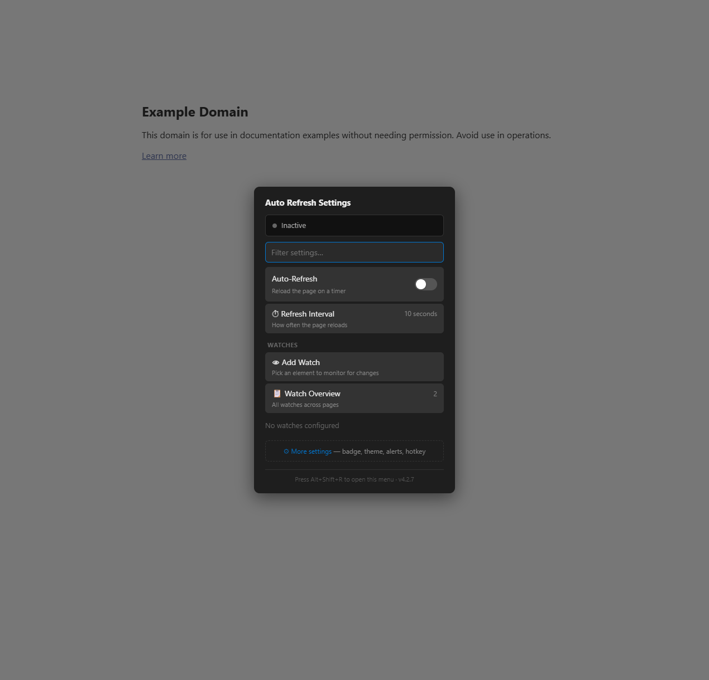
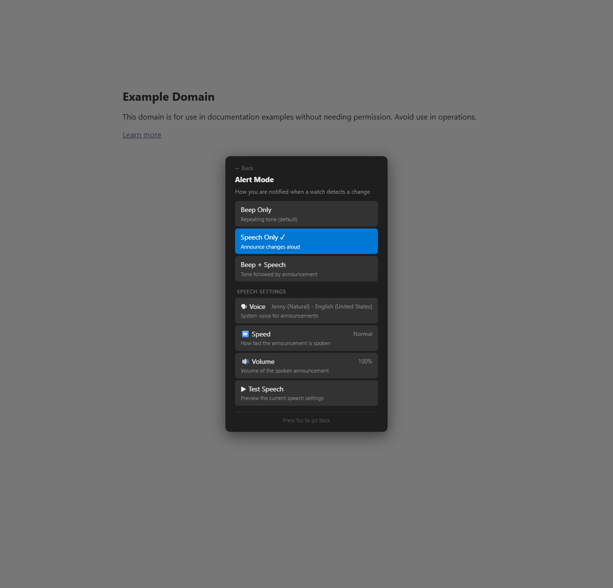
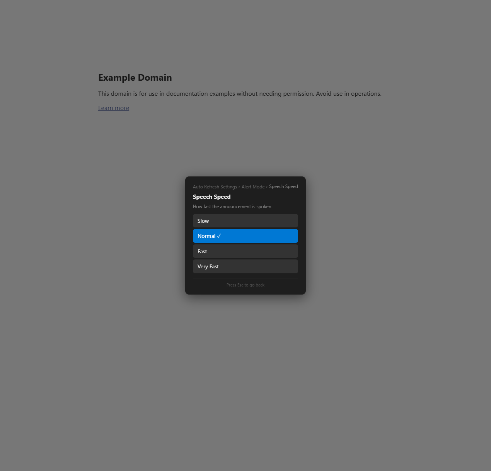

# Feature Spec: Smooth Modal Transitions

## Overview

Add animated slide and fade transitions when opening, closing, and navigating between modals, providing spatial orientation cues that reinforce the modal stack's push/pop model. Pushing a sub-modal slides the old content out to the left and the new content in from the right; popping reverses the direction. Opening a root modal fades/scales in (as today), and closing the last modal fades/scales out.

---

## Problem Statement

Currently, modal push/pop transitions are instantaneous — the old panel is hidden (`display:none`) and the new panel appears with only a subtle 150 ms scale+fade entrance. This works for a single modal, but when navigating a multi-level stack (Settings → Theme → Color Picker), users lose spatial context: they can't tell whether they went "forward" into a sub-modal or "back" to a parent. The flat swap makes the breadcrumb trail (Feature #49) the *only* directional cue. Adding directional slide animations creates an intuitive, app-like navigation feel.

---

## User Stories

- As a user navigating from Settings to a sub-modal, I want the old panel to slide away and the new one to slide in so I can sense "going deeper."
- As a user pressing Back or Escape, I want the current panel to slide out and the parent to slide back so I understand I'm "going back."
- As a user opening the Settings modal, I want the existing smooth scale+fade entrance preserved.
- As a user who prefers reduced motion, I want all animations to be suppressed when my OS-level `prefers-reduced-motion` setting is active.
- As a user with a slower device, I want animations to be short enough (≤200 ms) that they don't feel sluggish.

---

## UX Design

### Transition Types

| Action | Old Panel | New Panel | Duration |
|---|---|---|---|
| **Root open** (e.g., `Modal.open`) | n/a | Scale 0.97→1 + Fade 0→1 | 150 ms (unchanged) |
| **Push** sub-modal | Slide left + Fade out | Slide in from right + Fade in | 180 ms |
| **Pop** / Back | Slide right + Fade out | Slide in from left + Fade in | 180 ms |
| **Close last** (`pop` on depth 0) | Scale 1→0.97 + Fade 1→0 | n/a | 120 ms |
| **Close all** (`closeAll`) | Fade 1→0 (top panel only) | n/a | 120 ms |

### Slide Distance

- Horizontal slide offset: `30px` (subtle spatial cue without excessive movement)
- Combined with opacity fade from `0 → 1` for entering and `1 → 0` for exiting

### Visual Sketch — Push Transition

```
  Time 0ms                                Time 180ms
┌────────────────┐                      ┌────────────────┐
│   Settings     │  ←slides left        │   Theme        │
│   ██████████   │  ←fades out          │   ██████████   │
│   ██████████   │                      │   ██████████   │
│   ██████████   │     from right→      │   ██████████   │
└────────────────┘     fades in→        └────────────────┘
  opacity: 1→0                            opacity: 0→1
  translateX: 0→-30px                     translateX: 30px→0
```

### Visual Sketch — Pop Transition (reverse)

```
  Time 0ms                                Time 180ms
┌────────────────┐                      ┌────────────────┐
│   Theme        │  slides right→       │   Settings     │
│   ██████████   │  fades out→          │   ██████████   │
│   ██████████   │                      │   ██████████   │
│   ██████████   │  ←from left          │   ██████████   │
└────────────────┘  ←fades in           └────────────────┘
  opacity: 1→0                            opacity: 0→1
  translateX: 0→30px                      translateX: -30px→0
```

### Reduced Motion

When `prefers-reduced-motion: reduce` is active:
- All durations set to `0ms` (instant swap, same as today)
- No `transform` changes applied
- Opacity changes still applied but instantaneously

### Settings Integration

No new user-facing settings. The feature respects the OS-level `prefers-reduced-motion` media query automatically. This keeps the implementation simple and accessible by default.

---

## Technical Design

### CSS Additions

Add transition utility classes to the existing `<style>` block inside the shadow DOM:

```css
/* Push/pop slide transitions */
.ar-panel-exit-left {
  opacity: 0;
  transform: translateX(-30px);
}
.ar-panel-exit-right {
  opacity: 0;
  transform: translateX(30px);
}
.ar-panel-enter-from-right {
  opacity: 0;
  transform: translateX(30px);
}
.ar-panel-enter-from-left {
  opacity: 0;
  transform: translateX(-30px);
}

/* Close (reverse of root open) */
.ar-panel-exit-scale {
  opacity: 0;
  transform: scale(0.97);
}

/* Reduced motion override */
@media (prefers-reduced-motion: reduce) {
  .ar-panel {
    transition-duration: 0ms !important;
  }
}
```

The existing `.ar-panel` transition property (`transition: opacity .15s ease-out, transform .15s ease-out`) already handles the animation rendering. The new classes simply define the start/end states; adding or removing them triggers the CSS transition.

### Updated Transition Duration

Update the existing `.ar-panel` transition duration from `0.15s` to `0.18s` so push/pop transitions have a consistent 180 ms duration. Root open can use the same duration — the 30 ms difference from 150 ms is imperceptible.

```css
.ar-panel {
  transition: opacity .18s ease-out, transform .18s ease-out;
}
```

### Core Logic Changes

#### Constants

```javascript
const TRANSITION_MS = 180;
const CLOSE_TRANSITION_MS = 120;
```

#### `_show(id, extra)` — Push Path (lines ~2048–2111)

Current behavior:
1. Hide previous overlay (`display:none`)
2. Create new overlay + panel
3. `requestAnimationFrame` → set `opacity:1; scale(1)`

New behavior:
1. **Animate out** the previous panel: add class `ar-panel-exit-left` → wait `TRANSITION_MS`
2. After transition ends, hide the previous overlay (`display:none`)
3. Create new overlay + panel with class `ar-panel-enter-from-right` pre-applied
4. Append to shadow DOM
5. `requestAnimationFrame` → remove `ar-panel-enter-from-right`, set `opacity:1; transform: translateX(0) scale(1)` — the CSS transition handles the animation

```javascript
// In _show(), when stack.length > 0 (sub-modal push):
const prevEntry = stack[stack.length - 1];
const prevPanel = prevEntry.overlay.querySelector('.ar-panel');

// Animate previous panel out to the left
prevPanel.classList.add('ar-panel-exit-left');
prevEntry.removeKeyboard();

setTimeout(() => {
  prevEntry.overlay.style.display = 'none';
  prevPanel.classList.remove('ar-panel-exit-left');
  // Reset previous panel state for when it's restored on pop
  prevPanel.style.opacity = '1';
  prevPanel.style.transform = 'scale(1)';
}, TRANSITION_MS);

// New panel starts from the right
panel.classList.add('ar-panel-enter-from-right');
overlay.style.display = 'flex';
_shadow.appendChild(overlay);

requestAnimationFrame(() => {
  panel.classList.remove('ar-panel-enter-from-right');
  panel.style.opacity = '1';
  panel.style.transform = 'scale(1)';
});
```

#### `pop()` — Pop Path (lines ~2111–2140)

Current behavior:
1. Remove top overlay from DOM
2. Restore previous overlay (`display:flex`)
3. Re-attach keyboard trap

New behavior:
1. **Animate out** the current panel: add class `ar-panel-exit-right` → wait `TRANSITION_MS`
2. After transition ends, remove current overlay from DOM
3. Show previous overlay (`display:flex`)
4. Apply `ar-panel-enter-from-left` to previous panel
5. `requestAnimationFrame` → remove class, transition in from the left
6. Re-attach keyboard trap on previous modal

```javascript
// In pop(), when stack.length > 1 (sub-modal pop):
const top = stack.pop();
const topPanel = top.overlay.querySelector('.ar-panel');

// Animate current panel out to the right
topPanel.classList.add('ar-panel-exit-right');
top.removeKeyboard();
top.cleanups.forEach(fn => fn());

setTimeout(() => {
  top.overlay.remove();
}, TRANSITION_MS);

// Animate previous panel in from the left
const prev = stack[stack.length - 1];
const prevPanel = prev.overlay.querySelector('.ar-panel');
prev.overlay.style.display = 'flex';
prevPanel.classList.add('ar-panel-enter-from-left');

requestAnimationFrame(() => {
  prevPanel.classList.remove('ar-panel-enter-from-left');
  prevPanel.style.opacity = '1';
  prevPanel.style.transform = 'scale(1)';
  prev.removeKeyboard = createFocusTrap(prev.panel || prev.overlay);
});
```

#### `pop()` — Close Last Modal (depth 0)

When popping the last modal (stack becomes empty):
1. Add `ar-panel-exit-scale` class to animate scale(1→0.97) + fade out
2. Wait `CLOSE_TRANSITION_MS`, then remove overlay from DOM

```javascript
// In pop(), when stack.length === 1 (closing last modal):
const top = stack.pop();
const topPanel = top.overlay.querySelector('.ar-panel');

topPanel.classList.add('ar-panel-exit-scale');
top.removeKeyboard();
top.cleanups.forEach(fn => fn());

setTimeout(() => {
  top.overlay.remove();
}, CLOSE_TRANSITION_MS);
```

#### `closeAll()`

Animate only the topmost panel (exit-scale), then remove all overlays after the timeout:

```javascript
function closeAll() {
  if (stack.length === 0) return;
  const top = stack[stack.length - 1];
  const topPanel = top.overlay.querySelector('.ar-panel');
  topPanel.classList.add('ar-panel-exit-scale');

  setTimeout(() => {
    stack.forEach(entry => {
      entry.removeKeyboard();
      entry.cleanups.forEach(fn => fn());
      entry.overlay.remove();
    });
    stack.length = 0;
  }, CLOSE_TRANSITION_MS);
}
```

### Interaction During Transitions

- **Keyboard input blocked**: The focus trap is removed from the exiting panel immediately, and applied to the entering panel only after the transition completes (on the `setTimeout` callback). This prevents interaction during the transition.
- **Rapid push/pop**: If a user presses Escape rapidly during a transition, the pending `setTimeout` callbacks could conflict. Guard against this by checking `stack.length` in each callback before acting, and by skipping animation if the entry's overlay is already removed from the DOM.
- **Double-push guard**: The existing `_createOverlay` dedup (`querySelector('#' + id)` → remove if exists) handles duplicate pushes.

### Integration Points

- **Breadcrumb trail (Feature #49)**: The breadcrumb jumps multiple levels by calling `pop()` repeatedly. Rapid sequential pops should collapse into a single animation. Add a `_skipAnimation` flag that `pop()` can check — when breadcrumb calls pop N times, only animate the final transition.
- **`Modal.replace()`**: Replace is semantically a pop+push in one step. It should use the push animation (slide left out, slide right in) since the user is navigating forward to a replacement modal.
- **Toast system**: No changes — toasts animate independently of modal transitions.
- **Event bus**: Emit `modal:transition:start` and `modal:transition:end` events so other systems can react (e.g., pause auto-focus during transition).

---

## Edge Cases & Error Handling

- **`prefers-reduced-motion`**: All transitions collapse to 0 ms via the CSS media query override. JS timeouts still fire but have no visible effect.
- **Rapid Escape presses**: Guard `setTimeout` callbacks with `if (!overlay.isConnected) return;` to no-op if the overlay was already removed by a subsequent pop/closeAll.
- **Modal.open() during transition**: `open()` calls `closeAll()` first, which immediately removes all overlays (after the short fade). The new modal opens normally after the close timeout.
- **Panel resize during transition**: CSS `transform: translateX()` doesn't affect layout flow, so panel dimensions remain stable during the slide.
- **Very deep stacks (depth 5+)**: Only two panels are ever animating at once (the exiting one and the entering one). Stack depth doesn't affect transition performance.
- **Breadcrumb multi-level pop**: When the breadcrumb pops N levels at once, skip intermediate animations — only animate the final pop (from current depth to target depth).

---

## Scope & Non-Goals

### In Scope
- Directional slide+fade transitions for push and pop
- Scale+fade transitions for root open and close
- Reduced motion support via CSS media query
- Rapid interaction guards (no double-animation glitches)
- Breadcrumb multi-pop animation collapsing
- Event bus notifications for transition start/end

### Out of Scope (Future)
- User-configurable transition duration or easing
- User toggle to disable animations independently of OS setting
- Vertical slide transitions (e.g., for bottom-sheet style modals)
- Spring/bounce physics-based easing
- Shared element transitions (morphing a button into the modal)
- Touch gesture–driven transitions (swipe to go back)

---

## Risks & Open Questions

1. **setTimeout vs. transitionend**: This spec uses `setTimeout(fn, TRANSITION_MS)` for simplicity. An alternative is listening for the `transitionend` event on the panel, which is more precise but requires handling cases where the event doesn't fire (e.g., `display:none` suppression, reduced motion). The implementer should choose based on reliability testing.
2. **Breadcrumb multi-pop collapsing**: The spec proposes a `_skipAnimation` flag, but the exact mechanism depends on whether breadcrumb pops are synchronous or have their own async flow. The implementer should verify during integration.
3. **Modal.replace depth behavior**: Currently `replace` may pop and push in one tick. The transition for replace should feel like a forward navigation, but the implementer should verify timing with the actual `replace` implementation.
4. **Shadow DOM transition performance**: CSS transitions inside Shadow DOM should perform identically to light DOM, but this should be verified on lower-end hardware to ensure the 180 ms duration feels smooth.

---

## Implementation Details

**Version**: 4.3.0
**Date**: 2026-04-15
**Action Plan**: [action-plans/smooth-modal-transitions.md](../action-plans/smooth-modal-transitions.md)

### What Was Built
- Directional slide+fade transitions for modal push (slide left out, slide right in) and pop (slide right out, slide left in) at 180 ms
- Scale+fade close animation (120 ms) when dismissing the last modal or calling closeAll
- Root open animation updated from 150 ms to 180 ms for consistency
- `prefers-reduced-motion` CSS media query zeroes out all transition durations
- `_transitioning` guard flag prevents rapid Escape presses from creating glitched states
- Breadcrumb multi-level pop collapses intermediates without animation, only animating the final pop
- All transitions use inline styles (not CSS classes) due to inline style specificity overriding class rules

### Deviations from Spec
- **Inline styles instead of CSS classes**: The spec proposed CSS classes (`.ar-panel-exit-left`, etc.), but panels already have inline `opacity`/`transform` from `requestAnimationFrame`, which override class rules due to CSS specificity. Switched to direct inline style manipulation.
- **No EventBus events**: Deferred `modal:transition:start`/`modal:transition:end` — no consumers exist currently.
- **Breadcrumb multi-pop**: Used direct stack manipulation (pop intermediates, then animate final pop) instead of the spec's `_skipAnimation` flag approach.

### Code Location
| Component | Location |
|-----------|----------|
| Transition constants (`TRANSITION_MS`, `CLOSE_TRANSITION_MS`) | Line ~2147 |
| `_prefersReducedMotion` helper | Line ~2150 |
| `_show()` with push animation | Line ~2312 |
| `pop()` with directional animation | Line ~2395 |
| `closeAll()` with fade-out animation | Line ~2451 |
| Breadcrumb multi-pop collapsing | Line ~2183 |
| CSS `.ar-panel` transition duration (0.18s) | Line ~1275 |
| CSS `prefers-reduced-motion` override | Line ~1378 |

### Testing Notes
- All 12 test scenarios passed in browser
- Zero console errors throughout testing
- Keyboard navigation works correctly after push and pop transitions
- Breadcrumb multi-level jump (depth 3 → depth 1) works with animation collapsing
- Rapid Escape presses handled by `_transitioning` guard — no orphaned overlays

### Screenshots




