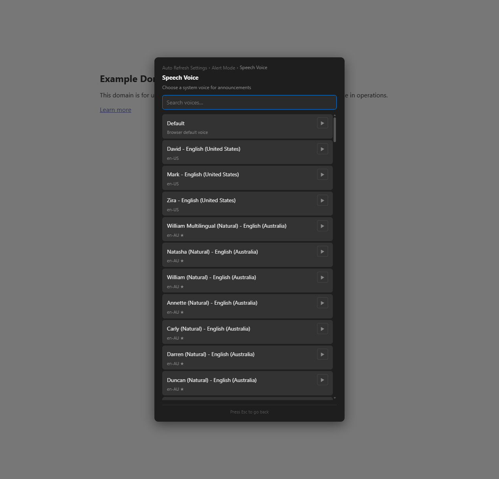
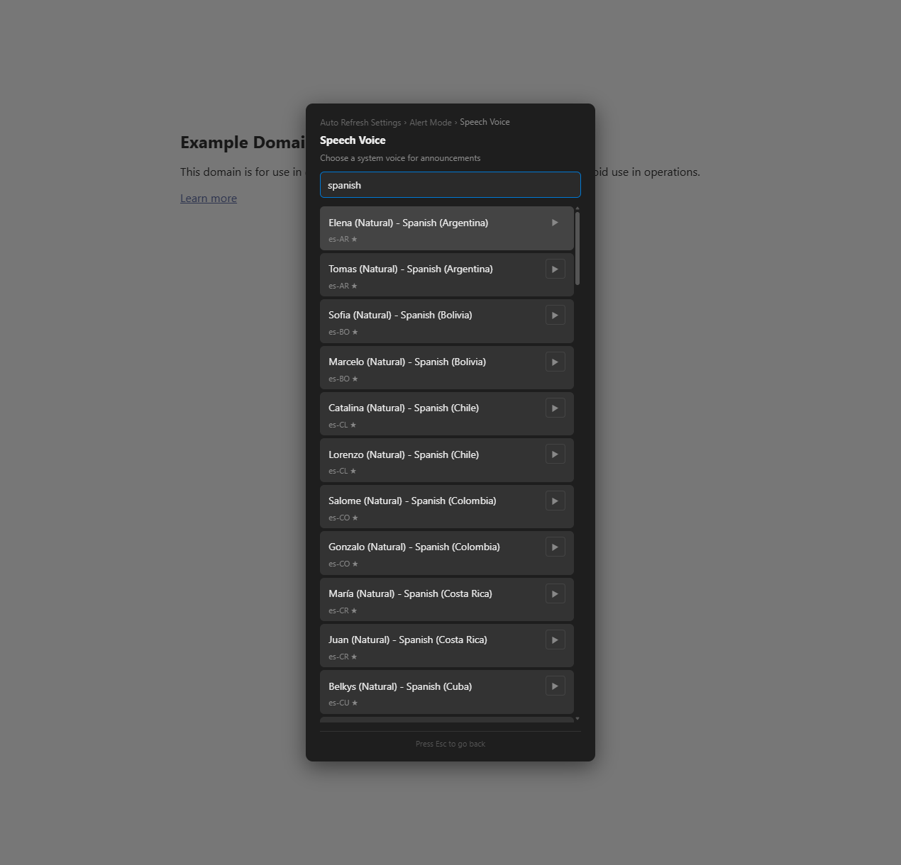

# Feature Spec: Voice Picker Redesign

## Overview

Redesign the TTS voice picker from a flat list of 500+ voices into a two-step language→voice flow with a search filter, "Natural" voice badges, and auto-preview on keyboard focus. This transforms voice discovery from scrolling through a massive list into a focused, audition-driven experience.

---

## Problem Statement

The current voice picker dumps all system voices into a single scrollable list. On Windows with Edge voices, this can be 500+ entries across 80+ languages. Even with the "Show all languages" progressive disclosure, expanding the list is overwhelming. Users can't quickly find voices for a specific language, can't distinguish standard from natural/neural voices, and must manually click preview buttons to hear each voice.

---

## User Stories

- As a user looking for a Spanish voice, I want to type "spanish" in a search field and see only Spanish voices instantly.
- As a user browsing voices, I want "Natural" voices visually distinguished from standard ones so I can prioritize higher-quality options.
- As a user navigating voices with arrow keys, I want to hear a brief sample automatically so I can audition without clicking each preview button.
- As a user who just expanded all languages, I want to filter down the massive list without scrolling through hundreds of entries.

---

## UX Design

### Search Filter

A text input at the top of the voice picker that filters voices by name or language code as the user types. Results update live with each keystroke.

```
┌──────────────────────────────────────────┐
│  Speech Voice                            │
│  Choose a system voice for announcements │
│──────────────────────────────────────────│
│  [🔍 Search voices…                   ] │
│──────────────────────────────────────────│
│  ✓ Default                       [▶]    │
│    Jenny (Natural) — en-US ★     [▶]    │
│    Mark — en-US                  [▶]    │
│    Zira — en-US                  [▶]    │
│                                          │
│  ⌄ Show all languages                   │
└──────────────────────────────────────────┘
```

When the user types, the list filters to show only voices whose name or language code contains the search term (case-insensitive). The "Show all languages" button is hidden during search (since search already spans all languages). The "Default" option is always shown unless the search doesn't match "default".

### Natural Voice Badges

Voices with "Natural" in their name get a small `★` badge after the language tag, visually distinguishing neural voices from standard ones.

```
│    Jenny (Natural) — en-US  ★    [▶]    │   ← Natural
│    Mark — en-US                  [▶]    │   ← Standard
```

### Auto-Preview on Focus

When a user navigates to a voice row via ArrowDown/ArrowUp and pauses for 800ms, a short preview automatically speaks using that voice. Moving to the next row cancels the previous preview and starts a new debounce timer. This eliminates the need to manually click each preview button during keyboard browsing.

- Debounce: 800ms after landing on a row
- Only triggers on keyboard focus (ArrowDown/ArrowUp), not mouse hover
- Does not trigger on preview buttons themselves (only on option rows)
- Cancelled on modal close via existing cleanup

### Settings Integration

No new settings. The feature enhances the existing voice picker UI.

---

## Technical Design

### Search Filter Implementation

Add an `<input>` with class `ar-input` at the top of the voice picker, before the scroll container. On `input` event, re-render the voice list filtered by the search term.

```javascript
// Inside tts-voice-picker build:
const searchInput = h('input', {
    class: 'ar-input',
    type: 'text',
    placeholder: t('voice.search'),
    style: 'width:100%;box-sizing:border-box;margin-bottom:8px'
});
panel.insertBefore(searchInput, container);
searchInput.addEventListener('input', () => renderVoices(showingAll, searchInput.value));
```

Modify `renderVoices(showAll, filter)` to accept a filter string. If present, match against `v.name` and `v.lang` (case-insensitive) and always search across all languages (ignore `showAll` flag during search).

### Natural Voice Detection

```javascript
function isNaturalVoice(v) {
    return /natural|neural/i.test(v.name);
}
```

When rendering a voice row, append a `★` badge span if `isNaturalVoice(v)` is true.

### Auto-Preview on Focus

Track a debounce timer. When the focus trap moves focus to a voice option row (`ar-btn` with a voice click handler), start an 800ms timer. If the timer fires, call `previewSpeak({ voice: voiceName })`. Cancel on any subsequent focus move or modal close.

The voice name needs to be stored on the button element as a data attribute (`data-voice`) so the auto-preview handler can read it.

### Integration Points

- **Existing `renderVoices()` function** — Modified to accept filter string
- **Existing `makePreviewBtn()`** — Unchanged; preview buttons still work manually
- **Existing `previewSpeak()`** — Used for auto-preview  
- **Focus trap** — The auto-preview debounce is wired to the focus trap's `setFocus` or to a `focusin` listener on the container
- **Cleanup** — Cancel debounce timer and `speechSynthesis.cancel()` on modal close

---

## Edge Cases & Error Handling

- **Empty search results**: Show "No matching voices" empty state
- **Search clears**: Restore the previous view (browser-language-only or all)
- **Auto-preview while typing**: Don't auto-preview when focus is on the search input
- **Rapid keyboard navigation**: Each ArrowDown cancels the previous debounce timer, so at most one preview fires
- **voices not loaded**: If `getVoices()` returns empty, search input is still shown but list shows "No voices available"

---

## Scope & Non-Goals

### In Scope
- Search filter input with live filtering
- "Natural" voice `★` badges
- Auto-preview on keyboard focus with 800ms debounce
- `data-voice` attribute on voice buttons for auto-preview

### Out of Scope (Future)
- Two-step language grid → voice list (deferred to avoid scope creep — search achieves the same goal more simply)
- Recently used voices section
- Comparison/shortlist mode
- Native-language sample sentences
- Collapsible language groups in the expanded view

---

## Risks & Open Questions

1. **Auto-preview accessibility**: Some users may find auto-preview annoying. The 800ms debounce should be long enough that quick browsing doesn't trigger audio, but this should be tested.
2. **Search performance**: With 500+ voices, filtering on each keystroke should be fast (simple string matching), but DOM rebuilds with many preview buttons could be noticeable. Consider debouncing the search input by 150ms.
3. **Focus management during search**: When search results change, the focus trap's `focusIndex` becomes stale. The search input should remain focused during typing (no trap interference).

---

## Implementation Details

**Version**: 4.5.0
**Date**: 2026-04-15
**Action Plan**: [action-plans/voice-picker-redesign.md](../action-plans/voice-picker-redesign.md)

### What Was Built
- **Search filter**: `ar-input` field at top of voice picker, 150ms debounced, filters voices by name or language code across all languages. Auto-focused on modal open.
- **Natural voice badges**: Voices with "Natural" or "Neural" in name get `★` appended to their language subtitle.
- **Auto-preview on focus**: 800ms debounced — when a voice button receives keyboard focus (via ArrowDown/ArrowUp), a preview automatically speaks using that voice. Cancelled on next focus move or modal close.
- **`data-voice` attribute**: Each voice button stores its voice name for auto-preview lookup.
- **Modified `renderVoices(showAll, filter)`**: Now accepts a filter parameter for search. When filter is active, search spans all languages regardless of `showAll` state. "Show all languages" hidden during search.
- **"No matching voices" empty state**: Shown when search yields no results.
- I18N keys: `tts.searchPlaceholder`, `tts.noMatch` (EN + ES)

### Deviations from Spec
- None — implemented as specced.

### Code Location
| Component | Location |
|-----------|----------|
| Voice picker modal (`tts-voice-picker`) | Line ~3011 |
| Search input + debounce | Line ~3021, ~3145 |
| `renderVoices(showAll, filter)` | Line ~3051 |
| `isNatural()` helper | Line ~3048 |
| Auto-preview `focusin` listener | Line ~3155 |
| I18N keys (EN) | Line ~431 |
| I18N keys (ES) | Line ~817 |

### Testing Notes
- Search "spanish" → 77 results with ★ badges
- Search "xyznonexistent" → "No matching voices"
- Clear search → restores browser-language view + "Show all" button
- ArrowDown from search input navigates into voice list
- 800ms pause on voice button triggers auto-preview (`speechSynthesis.speaking === true`)
- Escape cancels speech and cleans up timer
- Zero console errors

### Screenshots



